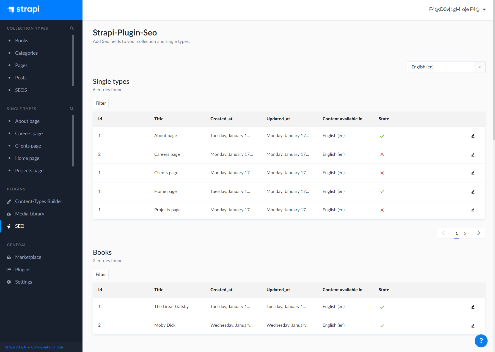
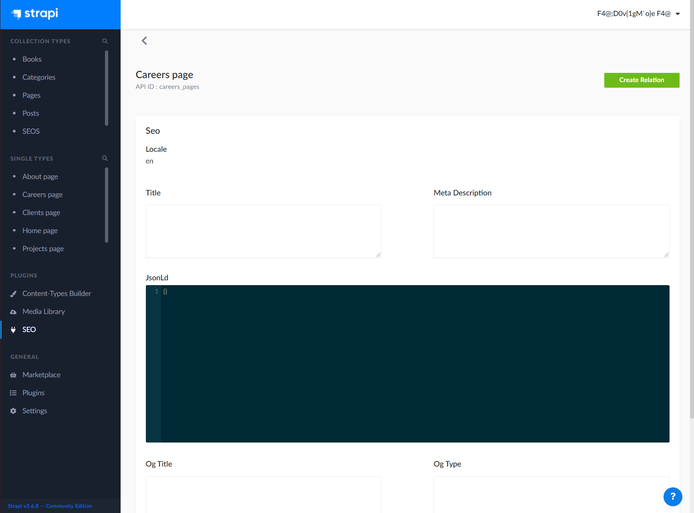
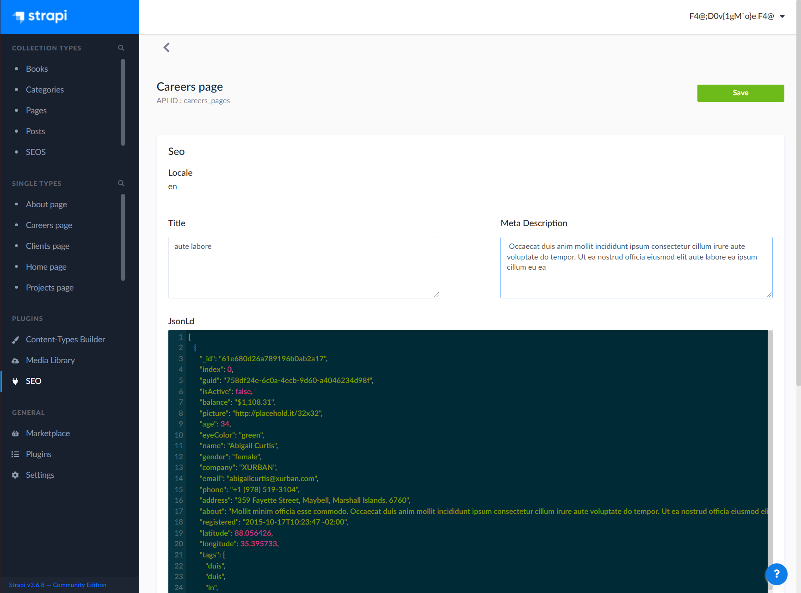
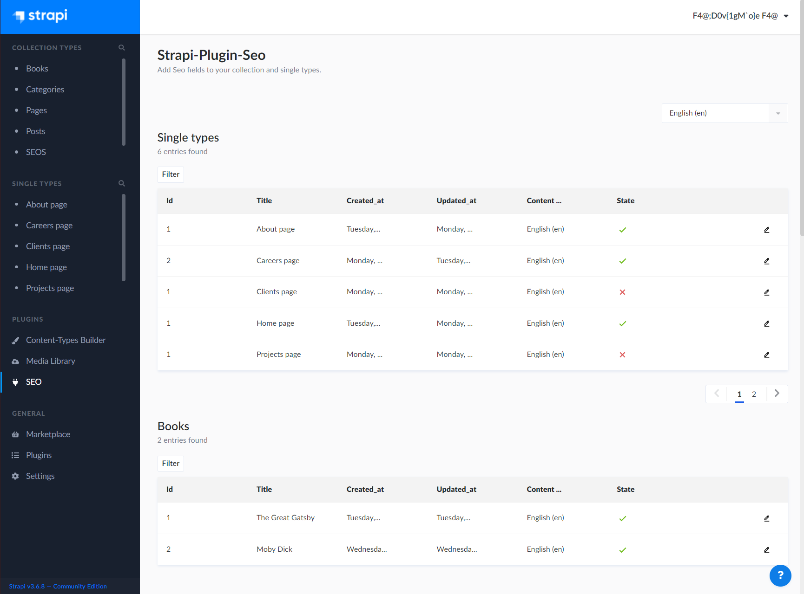
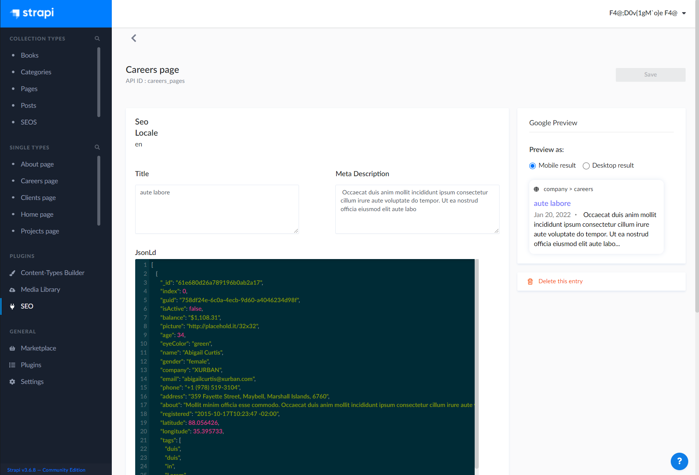

# Strapi-SEO-plugin

A plugin for Strapi Headless CMS that provides SEO fields to Single and Collection types.



# Versions

- Beta - v0.0.71

### 🖐 Requirements

- Compatible with Strapi v3.6.x but not Strapi v4.

- Title fields on Collection type and Single type resources.

- No components named SEO on Collection type or Single type resources.

- OgUrl field on seo form require this format:
  - `https://www.yourdomain.com`

### ⏳ Installation

(Use **yarn** to install this plugin within your Strapi project [Install yarn with these docs](https://yarnpkg.com/lang/en/docs/install/).)

```bash
npm i strapi-plugin-seo
```

To use yarn instead of npm use.

```bash
yarn add strapi-plugin-seo
```

After successful installation you've to build a fresh package that includes the plugin UI.

```
npm build
npm develop
```

The Seo plugin should appear in the Plugins section of Strapi sidebar after you run the app again.

## How it works

The plugin adds an seo object to the api response of single and collection types.

**Example response**

```
...
seo: {
    id?: Number,
    title: String,
    metaDescription: String,
    jsonLd: JSON,
    ogTitle: String,
    ogType: String,
    ogUrl: String,
    ogImage: String,
    locale?: String,
    collectionTypeName?: String,
    seoName?: String,
    created_at?: String,
    updated_at?: String
}
...
```

## How to use

### Seo Creation

1. Choose the Collection type or Single type resource you would like to add an seo to.

   In this case we will create an seo for Careers page.


2. Click on the edit button of the resource.

3. Click on Create Relation button ( only visible if relation hasn't been created ) to create a one-way relationship between the seo and the resource.



4. Enter the seo data in the respective fields:
   - Title;
   - MetaDescription;
   - JsonLd;
   - OgTitle;
   - OgType;
   - OgUrl;
   - OgImage;



5. Click save.

6. If successfully saved, you should see a green checkmark in place of a red cross.



### Seo Edition

1. Click on the edit icon of the collection or single type resource.

   In this case Careers page.

   On this view you can edit the seo data you previously saved.



**Supported Strapi versions**:

- Strapi v3.6.6

- Strapi v3.6.7

- Strapi v3.7.7

## Features

- **i18n:** Built-in i18n support, seo fields can be created for any language enabled in the Strapi project.

- **Zero Configuration:** Simply install the the plugin.

- **Google Preview:** Preview how your page will look like in Google’s search results.

## Local Development

- Download plugin repo https://gitlab.com/develocraft/strapi-seo-plugin
- Create new strapi project (if you don't have one already.)
- Create plugins folder at strapi project root level.
- Copy plugin repo to plugins folder.
- Rename plugin repo in plugins folder to seo.

### How To Test

`yarn test`

### Issues

Please open GitHub issue.

### License

MIT License Copyright (c) [Develocraft Sp.z.o.o](https://develocraft.com/)

### Keywords

strapi plugin seo
